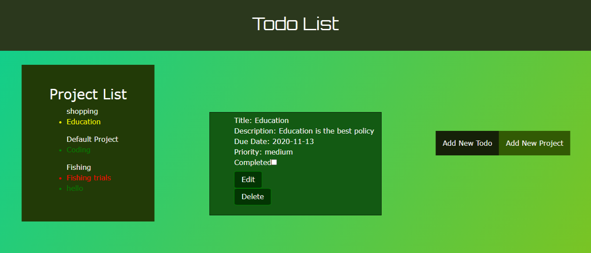

# README

 

# This Project is a Todo-List app build using JavaScript to render the page.

> In this project, we built a `Todo-List` app following the [OdinProject](https://www.theodinproject.com/courses/javascript/lessons/todo-list) specification. 

## Project Description

The project is initialized by running `npm install webpack webpack-cli --save-dev` to install webpack to the node_modules directory of your project.
A `src and dist` is created in the directory with the following contents:
- `index.js` file in src.
- `index.html` file in dist. 
- `main.js` is by generated by webpack when you run `npm run build`.
- A `webpack.config.js` is created to do the basic configurations.
- An HTML skeleton inside of `dist/index.html` file.

The `‘todos’` are objects dynamically created, using factories or constructors/classes to generate them.

### The Todo Has The Following Properties:

- It has projects or separate lists of todos. 
- When a user first opens the app, there is ‘default’ project to which all of their todos are put.  
- Users should be able to create new projects and choose which project their todos go into.
- User should be able to view all projects.
- User should be able to view all todos in each project .
- User should be able to expand a single todo to see/edit its details
- User should be able to delete a todo

The application logic is modularize (i.e. creating new todos, setting todos as complete, changing todo priority etc.) from the DOM-related stuff.

`The project is hosted on gh-pages.`

## 

## Link to Live Demo:

[Restaurant](https://uimarshall.github.io/microverse-restaurant-project/)

## Built With

- JavaScript ES6
- HTML
- CSS
- Bootstrap
- WebPack bundler

## Deployed on:

- gh-pages

## Prerequisities

To get this project up and running locally, you must have  yarn and node installed on your computer.

## Getting Started

**To get this project set up on your local machine, follow these simple steps:**

**Step 1** 
Navigate through the local folder where you want to clone the repository and run
`git clone https://github.com/uimarshall/microverse-todo-list.git`. 

**Step 2** 
`cd microverse-todo-list`. 

**Step 3** 
Run `npm install` to install the packages from the `package.json`. 

**Step 4** 
Run `npm start` to open the application in a browser of your choice. 

**Step 5** 
You can navigate to `http://localhost:8080/` to see your application running 

## Authors

👤 **Marshall Akpan**

- Github: [uimarshall](https://github.com/uimarshall)
- Twitter: [uimarshall](https://twitter.com/uimarshall)
- Linkedin: [Marshall Akpan](https://www.linkedin.com/in/marshall-akpan-19745526/)

👤 **Brandon Defoe**

-   Github: [@defoebrand](https://github.com/defoebrand)
-   LinkedIn: [@defoebrand](https://www.linkedin.com/in/defoebrand/)
-   Gmail: <mailto:defoe.brand@gmail.com>

## 🤝 Contributing

Our favourite contributions are those that help us improve the project, whether with a contribution, an issue, or a feature request!

Feel free to check the [issues page](https://github.com/uimarshall/microverse-todo-list/issues) to either create an issue or help us out by fixing an existing one.

## Show your support

If you've read this far....give us a ⭐️!

## :clap: Acknowledgements

- Microverse
- OdinProject

## 📝 License

This project is licensed by Microverse and the Odin Project

- ...
